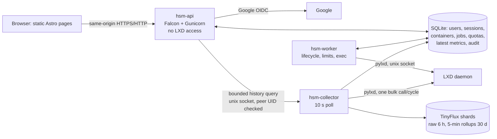

# Hobby Server Monitor

A small on-premises control panel for one LXD host: Google sign-in for invited
people only, an admin inventory of every container with live metrics, container
creation within host capacity and per-user quotas, lifecycle and limit changes,
a real command runner, metric history for 30 days, and allocation/consumption
accounting. Stack: **Falcon · Astro · pylxd · sqlite3 · TinyFlux**.

> Status, measured numbers and known gaps: [REPORT.md](REPORT.md).
> Design reasoning: [docs/decisions.md](docs/decisions.md).
> Exact API shapes: [docs/api-contract.md](docs/api-contract.md).
> Test and measurement evidence: [docs/verification.md](docs/verification.md).

## 1. Setup: fresh Ubuntu 22.04+/WSL2 → running dashboard

Tested on Ubuntu 22.04 under WSL2 with systemd. Native Ubuntu works the same way.

### 1.1 Prerequisites
- WSL2 only: systemd enabled (`/etc/wsl.conf` → `[boot] systemd=true`, then `wsl --shutdown`),
  and ≥ 10 GB free on the drive holding the WSL disk.
- `git`, `make`, Python ≥ 3.10, Node.js ≥ 18 with npm (Node 22 LTS used here;
  e.g. `curl -fsSL https://deb.nodesource.com/setup_22.x | sudo -E bash - && sudo apt-get install -y nodejs`).

### 1.2 Get the code
```bash
git clone <this repository> hobby-server-monitor
cd hobby-server-monitor
```

### 1.3 LXD and host packages (once, with sudo)
Read the script first; it is idempotent and never deletes or re-initialises existing LXD objects.
```bash
sudo bash scripts/setup-dev-host.sh
newgrp lxd        # or open a new shell, so the lxd group applies (development only)
```
It installs `python3-venv`, `btrfs-progs`, LXD 5.21 LTS (snap), and creates — only if missing —
a btrfs loop storage pool `hsm-btrfs` (quota-capable), a NAT bridge `hsmbr0`, a **restricted**
LXD project `hsm` (unprivileged only, no nesting, no raw/low-level keys, managed disks/NICs only,
network access limited to `hsmbr0`), and caches `hsm/ubuntu-24.04` and `hsm/alpine-3.22` images.
Only images whose alias starts with `hsm/` are offered in the create form.

### 1.4 Google OAuth credentials
1. <https://console.cloud.google.com/> → create a project (no billing needed).
2. *APIs & Services → OAuth consent screen*: External, app name, your email; scopes
   `openid`, `email`, `profile`; while in *Testing*, add every Google account that will sign in
   as a **test user**.
3. *Credentials → Create credentials → OAuth client ID → Web application*:
   - Authorized JavaScript origin: `http://localhost:8000`
   - Authorized redirect URI: `http://localhost:8000/auth/google/callback`
4. Copy the client ID and secret into `.env` (next step).

### 1.5 Configure
```bash
cp .env.example .env
python3 -c "import secrets; print(secrets.token_hex(32))"   # paste as SESSION_SECRET
$EDITOR .env    # GOOGLE_OAUTH_CLIENT_ID/SECRET, SESSION_SECRET, BOOTSTRAP_ADMIN_EMAIL
```
On WSL with the checkout under `/mnt/<drive>`, also set `HSM_DATA_DIR=/home/<you>/.local/share/hsm`
(SQLite WAL must live on a Linux filesystem).

### 1.6 Install, initialise, build
```bash
make venv          # .venv with pinned requirements
make init-db       # empty machine -> schema (no manual SQL)
make build-ui      # npm ci + astro build -> dashboard/dist
make test          # backend tests against a fake LXD
```

### 1.7 Run
Development (three processes in one terminal):
```bash
make dev           # API on http://localhost:8000, worker, collector
```
Production-style (systemd, separate service users, starts at boot):
```bash
sudo bash deploy/install.sh                     # add HSM_IMPORT_FROM=<dev data dir> to keep dev data
sudo bash deploy/check-permissions.sh           # proves hsm-api cannot reach the LXD socket
```
WSL note: WSL stops the distro (and these services) shortly after the last terminal window
closes, even with systemd enabled. Keep an Ubuntu terminal open while using it; a native Ubuntu
host has no such limitation.

### 1.8 First admin
```bash
make bootstrap     # or, with systemd: sudo -u hsm-worker env HSM_ENV_FILE=/etc/hsm/hsm.env /opt/hsm/venv/bin/hsm bootstrap
```
Paste the printed `http://localhost:8000/setup/#…` link (valid 30 minutes, once — the part after
`#` matters) into the browser and sign in with the `BOOTSTRAP_ADMIN_EMAIL` Google account. Do not use
the normal "Sign in with Google" button for this first login: without the setup link it is refused
as `NOT_INVITED`.

### 1.9 How quotas, owners and access fit together
- **Quota** is a per-user budget (cores, memory, disk). Everyone starts at 0, the first admin too.
- **Owner**: each container is charged to exactly one user's quota, chosen at creation.
- **Access**: who can see and use a container. Free (charges no quota). A non-admin owner gets
  access automatically; anyone else is added on the container page → Access.

Typical order: set the owner's quota (Users) → create the container for that owner → optionally
give other users access → they sign in and see only their containers. Invite users from **Users**;
each invitation link is shown once and must be opened by the invited Google account.

## 2. Architecture



- **hsm-api** authenticates, authorizes (default-deny route policies + object checks), validates,
  answers reads from SQLite, and turns every change into a durable operation (`202 Accepted`).
  It is not in the `lxd` group and does not import pylxd (`tests/test_boundaries.py`).
- **hsm-worker** claims operations with a lease, re-checks the actor's current rights, the
  container's live safety and capacity, calls LXD, then commits accounting and releases the
  quota reservation in one transaction. Uncertain outcomes are reconciled, never guessed.
- **hsm-collector** polls LXD every 10 s on a monotonic schedule whether or not anyone is
  looking, reconciles inventory (stable UUIDs across renames), writes the latest-metrics cache,
  and is the only owner of the TinyFlux files. Browser tabs read the cache; they never cause LXD calls.
- The dashboard polls `/api/containers` every 10 s only while the tab is visible.

## 3. Data model

SQLite schema: [backend/hsm/migrations/0001_initial.sql](backend/hsm/migrations/0001_initial.sql).

| Table | Purpose |
|---|---|
| `users` | Google `sub` (bound at admission), email, role `admin`/`user`, status `pending`/`active`/`revoked`, quota (cores, bytes, bytes) |
| `invitations` | hashed one-time secret, expiry, accepted/revoked; one open invitation per email |
| `sessions` | hashed session token, absolute expiry, last seen, revoked |
| `oauth_transactions` | hashed state, browser-binding hash, nonce, PKCE verifier, admission context, single use |
| `containers` | stable app UUID, current project/name, `user.hsm.id` marker, managed/safety, owner, **committed** limits (worker) vs **observed** limits (collector), tombstone |
| `container_access` | user ↔ container grants (no quota charge) |
| `operations` | typed durable jobs: state, idempotency key + request hash, lease, error, short-lived result |
| `quota_reservations` | pending positive deltas per operation, released exactly once |
| `latest_metrics` | one row per live container: state, CPU %, memory, disk, network counters and rates, processes, IPv4, start time, sample time, quality flags |
| `audit_events` | actor/target snapshots, action, outcome, before/after details (never secrets or command output) |
| `service_state` | heartbeats, LXD capability snapshot, rollup checkpoint, bootstrap record |

TinyFlux layout (collector-owned):

| Measurement | Shards | Tag | Fields |
|---|---|---|---|
| `c_raw_v1` | hourly `metrics/raw/YYYYMMDDHH.csv`, kept 6 h | `cid` = container UUID | state, cpu_ns, cpu_pct, cores, mem, mem_lim, disk, disk_lim, rx, tx, rx_rate, tx_rate, procs, dt, cpu_d_ns, rx_d, tx_d |
| `c_5m_v1` | daily `metrics/rollup/YYYYMMDD.csv`, kept 30 d | `cid` | covered_s, cpu_s, cpu_alloc_s, mem_bs, mem_max, disk_bs, disk_max, rx_d, tx_d, procs_max, samples |

Unknown values are stored as `None` and shown as "unknown", never as 0. Names, emails and other
mutable labels are never used as tags.

## 4. API reference

Full shapes, units and error codes: [docs/api-contract.md](docs/api-contract.md). Summary:

| Method & path | Role | Purpose |
|---|---|---|
| `GET /auth/google/start` | public | begin Google sign-in |
| `POST /auth/admission-context` | public, rate-limited, same-origin | bind an invitation/bootstrap secret to the sign-in |
| `GET /auth/google/callback` | OAuth state | finish sign-in, create session |
| `POST /auth/logout` | signed in | revoke session |
| `GET /api/me` | signed in | identity, CSRF token, own quota |
| `GET /api/containers` | signed in (filtered) | inventory + latest metrics |
| `GET /api/containers/{id}` | admin or assigned | detail |
| `GET /api/containers/{id}/history` | admin or assigned | bounded chart data (≤ 600 points/series) |
| `GET /api/containers/{id}/usage` | admin or assigned | consumption over a period, with coverage |
| `POST /api/containers/{id}/exec` | admin or assigned (managed, safe) | run one command |
| `GET /api/operations/{id}` | actor or admin | operation status/result |
| `GET /api/creation-options` | admin | discovered images/pools/networks + live bounds |
| `POST /api/containers` | admin | create (quota reserved atomically) |
| `PATCH /api/containers/{id}/limits` | admin | CPU/allowance/memory/disk (disk grow-only) |
| `POST /api/containers/{id}/actions` | admin | start/stop/restart/freeze/unfreeze |
| `DELETE /api/containers/{id}?confirm_name=` | admin | delete |
| `PATCH /api/containers/{id}/owner` | admin | transfer resource owner |
| `PUT/DELETE /api/containers/{id}/assignments/{user}` | admin | grant/revoke access |
| `GET /api/users`, `PATCH /api/users/{id}`, `POST /api/users/{id}/revoke` | admin | users, roles, quotas, revocation |
| `POST /api/invitations`, `DELETE /api/invitations/{id}` | admin | invitations |
| `GET /api/accounting` | admin | host/pool and per-owner allocation |
| `GET /api/audit-events` | admin | audit trail |
| `GET /api/health`, `GET /health/live` | signed in / public | freshness / liveness |

Unsafe methods need `X-CSRF-Token` and a same-origin `Origin`; mutations and exec need
`Idempotency-Key`. A signed-in user requesting an existing container they are not assigned
gets **403**; an unknown id gets 404.

## 5. Security notes

Threat model summary (details and reasoning in [docs/decisions.md](docs/decisions.md)):

| Threat | Control |
|---|---|
| Stranger signs in with any Google account | invitation-only admission: one-time secret + verified matching email, then bound to Google `sub` |
| First-admin race on a new server | configured email **and** CLI-issued one-time setup secret; completion persisted |
| Stolen/forged session, CSRF | opaque server sessions (hash stored), HttpOnly/SameSite/Secure cookies, CSRF token + Origin check, idle/absolute expiry, real logout |
| Forgotten authorization on a new endpoint | start-up fails if any responder lacks a declared policy; shared object checks in API and worker |
| Horizontal access (user A → user B's container) | 403 on every container route, operation results private to the actor, lists filtered in SQL |
| Web process compromise → host root via LXD | API is not in `lxd` and never imports pylxd; only typed jobs reach the worker, which re-validates them |
| Privileged/escaping containers | restricted project; worker builds config itself (no raw keys, no host mounts, no device passthrough, no nesting/privileged); expanded config re-checked before mutation and exec |
| Terminal used against the host | commands run only via LXD exec inside the container; non-root guest uid for users; fixed env; 4 KiB command, 64 KiB output, 20 s deadline; leftover processes killed; plain-text rendering |
| Resource exhaustion | per-owner quotas + host reserves, hard CFS CPU quota, memory without swap, `limits.processes`, bounded history queries, bounded metric storage |
| Secrets in logs/URLs | invitation/bootstrap secrets in URL fragment → POST body; only hashes stored; `Referrer-Policy: no-referrer`; no query strings in dev logs |

**LXD privilege decision.** Access to the LXD socket is equivalent to root on the host, whatever
the Unix UID. It is therefore confined to two non-network processes with narrow, typed inputs;
the internet-facing API has none. A compromise of the worker or collector is still a host
compromise — this residual risk is accepted and documented in REPORT.md.

## 6. Configuration

Every variable, its default and unit is documented inline in [.env.example](.env.example).
Groups: public URL and deployment mode; Google OAuth; sessions; bootstrap admin; storage paths;
LXD socket, project and allowlists; capacity reserves; collector and retention; history bounds;
command execution bounds; housekeeping; API listener.

## 7. Operations

- Logs: `journalctl -u hsm-api -u hsm-worker -u hsm-collector -f`.
- Reboot: units are enabled; LXD containers with *autostart* start with LXD; the collector resumes
  history; the worker reconciles operations whose lease expired.
- Backup: `sqlite3 /var/lib/hsm/app.db ".backup '/backup/app.db'"` (consistent with WAL); stop
  `hsm-collector` before copying `/var/lib/hsm/metrics`.
- Lost admin: `sudo -u hsm-worker env HSM_ENV_FILE=/etc/hsm/hsm.env /opt/hsm/venv/bin/hsm recover-admin --email you@example.com` (local, audited).

## 8. Tests and verification

```bash
make test        # backend: auth, policy, quotas, worker, collector (fake LXD)
make check-ui    # astro check + CSP check of the build
make smoke-lxd   # real LXD on one disposable hsm-spike-* container in project hsm only
make measure     # CPU/RSS/PSS of the running processes
```
Results, including what could not be verified: [docs/verification.md](docs/verification.md).
