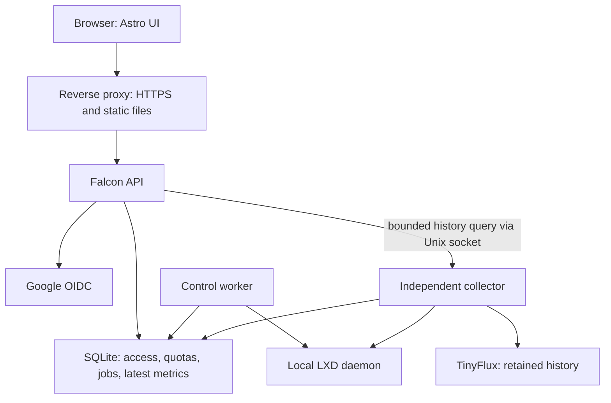

# Hobby Server Monitor — implementation plan

> Prepared for Shazan's RoboticGen Software Engineer Intern assessment.
> Source of truth: [the current Notion assessment](https://roboticgen.notion.site/interview-task-hobby-server-monitor), read in full on 6 October 2026.
> Status: design and execution plan; implementation and performance results are not yet verified.

## 1. The delivery strategy

Build a small, reliable on-premises LXD control panel using **Falcon + Astro + pylxd + sqlite3 + TinyFlux**. Prioritize a real, reproducible end-to-end system, explicit authorization, correct quota accounting, and measured operating cost.

The current brief gives **7 October 2026 as the soft deadline and 9 October 2026 as the hard deadline**. It does not specify a cutoff time or timezone. Target a submission-ready build on **8 October, Sri Lanka time**, leaving 9 October for contingency. The older similarly named GitHub template has different dates and submission instructions; do not use those as the current brief.

Create the repository from, or fork, the [template linked by the current brief](https://github.com/RoboticGen/roboticgen-se-interview-task-Hobby-Server-Monitor-Template). Inspect its actual contents before changing the layout. Push incremental commits and reply to the task email with the repository link. A short demo recording is useful supporting evidence, although the current submission instruction specifies the repository link.

### What earns marks

| Assessment area | Weight | Evidence to produce |
| --- | ---: | --- |
| Judgment and defense | 25% | Short decision records with rejected alternatives and actual tradeoffs |
| Security and correctness | 20% | API authorization tests, quota race tests, terminal isolation checks |
| Functional completeness | 20% | Browser workflow using real Google sign-in and real LXD |
| Code quality | 10% | Small modules, shared policy, explicit error handling |
| Documentation and report | 10% | A clean-machine setup that another person can follow |
| Resource efficiency | 10% | Recorded idle/load measurements, retention evidence, bounded queries |
| UX | 5% | Clear loading, empty, pending, stale, and failure states |

Tests, CI, systemd units, and a useful threat model are worthwhile additions. Finish the baseline before snapshots, alerts, or visual extras.

### Non-negotiable completion rules

- Real LXD integration must work before building most of the UI.
- Collection continues every 10 seconds without any browser or API process running.
- Every private endpoint has an explicit authorization policy.
- Unknown or stale values appear as unavailable, never as invented zeroes.
- Quota checks and reservations are atomic; the browser cannot override them.
- Terminal commands execute inside the authorized container only.
- History survives restarts, has finite retention, and returns bounded chart payloads.
- Publish measured resource figures, with the machine and method used.
- Understand and be able to explain every submitted module, including AI-generated code.

## 2. Scope and assumptions

### Core scope

1. Google sign-in, invite-only admission, two roles, logout, and immediate revocation.
2. Admin inventory of all containers on the single host, including discovery across configured LXD projects.
3. Container creation, live CPU/RAM limit changes, supported disk expansion, lifecycle actions, and confirmed deletion.
4. User invitations, assignments, role changes, revocation, and resource quotas.
5. Latest metrics, historical charts, host allocation, and per-user accounting.
6. Real command execution with bounded output and clear execution status.
7. Durable audit records, migrations, systemd deployment, tests, README, and REPORT.

### Explicit assumptions

| Question | Decision |
| --- | --- |
| Deployment size | One Linux host; initially validate at 1, 5, and 10 containers. State the tested upper bound. |
| Platforms | Native Ubuntu preferred; WSL2 with systemd is a development alternative. Record actual versions. |
| LXD objects | Linux containers are in scope; VMs are excluded and visibly labeled if discovered. |
| Project policy | New containers live in an operator-created restricted project. Admin inventory still covers other host containers. |
| Existing containers | Discover and show them. Require explicit adoption, finite limits, and a safety check before terminal access or app management. |
| Who creates containers? | Admin only. A Container User views and executes commands on assigned containers. |
| Who pays a shared container's quota? | Exactly one resource owner; access grants are separate and do not duplicate charges. |
| Invitations | Admin enters an email and gets a one-time invitation link to share. Automated email delivery is optional. |
| Terminal | A command runner with stdout, stderr, and exit status. A persistent PTY is optional. |
| Public deployment | Not required. Demonstrate on the intended Ubuntu/WSL host; use HTTPS for non-local browser access. |

Do not silently reduce “all containers” to “the containers created by this app.” Show unmanaged objects and explain why unsafe objects have disabled controls. Adoption is a small explicit operation, not an automatic grant of privileges.

### Excluded until the baseline is complete

Multi-host management, Kubernetes, Redis/Celery, a separate database server, public registration, password authentication, billing, arbitrary LXD configuration editors, host terminals, file upload, image uploads, arbitrary image registries, container migration, and full browser PTYs.

## 3. Architecture and process boundaries

Use **one Python codebase with three small process entry points**, plus a static Astro build. These are local processes sharing typed application code, not separately deployed network services.



### Process responsibilities

| Process | Responsibilities | Privilege |
| --- | --- | --- |
| `hsm-api` | OAuth, sessions, policy, validation, metadata, accepting jobs, querying cached metrics | No LXD socket or `lxd` group access |
| `hsm-worker` | Revalidate and execute approved lifecycle/resource/terminal jobs; reconcile outcomes | LXD access; no public listener |
| `hsm-collector` | Poll LXD, reconcile inventory, publish latest metrics, own TinyFlux, serve bounded history reads | LXD access; private Unix history socket only |
| Reverse proxy | Serve Astro output and proxy same-origin API/auth routes | No LXD or application database access |

The separate control worker adds a small amount of code and memory but keeps long operations away from HTTP and collection. SQLite is sufficient for the durable job queue at this scale. Do not add a broker.

### TinyFlux ownership

TinyFlux is not a concurrent database server. **Only the collector process opens its files.** Put all reads, writes, rollups, and retention work through one serialized store owner. The collector's LXD polling scheduler is separate from that storage loop; history requests have a bounded queue, range, point count, and scan size. Give sample ingestion priority.

Expose one narrow local request type for history through a filesystem-protected Unix socket. Accept typed JSON, never pickle, Python expressions, file paths, or arbitrary database queries. Check the connecting OS identity; recheck the requesting user's current container access. The API authorizes before forwarding as well. Stop accepting expensive queries when the queue is full.

This keeps chart reads from duplicating LXD polling, avoids stale TinyFlux indexes across processes, and preserves one owner for retention. Verify latency under simultaneous chart reads during the first integration spike.

### Application organization

Adapt these responsibilities to the actual template rather than creating empty abstractions:

| Path | Purpose |
| --- | --- |
| `backend/hsm/app.py` | Falcon application factory and route registration |
| `backend/hsm/api/` | Thin request/response resources |
| `backend/hsm/auth/` | OIDC, sessions, CSRF, authorization policy |
| `backend/hsm/services/` | Containers, users, quotas, operations, accounting |
| `backend/hsm/repositories/` | Parameterized SQLite queries and transactions |
| `backend/hsm/integrations/lxd.py` | One adapter around pylxd and version-dependent behavior |
| `backend/hsm/worker.py` | Durable operation runner and recovery |
| `backend/hsm/collector/` | Scheduler, normalization, TinyFlux owner, rollups, history protocol |
| `backend/migrations/` | Ordered SQL migrations |
| `frontend/src/` | Astro pages/components, TypeScript interactions, chart module |
| `tests/` | Policy, quota, integration, recovery, and browser tests |
| `scripts/` | Setup verification, migration entry point, benchmark harness |
| `deploy/` | systemd units, reverse-proxy configuration, permission setup |
| `docs/decisions.md` | Concise architecture decisions and alternatives |
| `README.md`, `REPORT.md`, `.env.example` | Reviewer-facing setup, evidence, configuration |

## 4. Stack decisions

| Concern | Choice and reason |
| --- | --- |
| API | Falcon WSGI with a small Gunicorn configuration. The API performs bounded work; no WebSockets are needed for the core command runner. |
| Frontend | Astro static build with TypeScript for forms, polling, and charts. No Node server in production. |
| UI state | Page-local state and a shared API client. Avoid a global state framework for this scope. |
| Charts | One small chart library, loaded only on detail/accounting screens; pin and measure its bundle. |
| LXD | pylxd behind a narrow adapter; use its underlying API only for verified missing behavior. |
| Metadata | Python `sqlite3`, foreign keys enabled on every connection, WAL, busy timeout, short transactions. |
| Metrics | TinyFlux with explicit sharding, rollups, and retention. |
| Auth | A maintained OAuth/OIDC library and Google token verification. Do not implement JWT signature verification yourself. |
| Sessions | Opaque random server-side sessions in SQLite, rather than self-contained application JWTs. |
| Deployment | Native services managed by systemd; static assets through a reverse proxy. |

Pin mutually compatible, maintained versions during setup. The brief's minimum Python/Node versions are minimums, not instructions to install old runtimes. Record the tested Ubuntu, kernel, LXD channel/version, Python, Node, and dependency versions.

## 5. Authentication, authorization, and revocation

### Google login flow

1. Backend creates a short-lived OAuth transaction bound to the browser, with random state, nonce, and PKCE where supported by the selected flow/library.
2. Redirect to Google with only `openid email profile` scopes and a fixed configured callback URL.
3. Verify state, expiry, single use, and the browser binding before exchanging the code.
4. Verify ID-token signature, issuer, audience, expiry, nonce, and verified email using maintained libraries.
5. Match an existing identity by Google's immutable `sub`, never by display name.
6. For first admission, require the matching unused invitation and its one-time secret. Bind the accepted account to `sub` atomically.
7. Reject uninvited or revoked users even if Google authentication succeeds.
8. Issue a new application session and discard Google tokens that are not needed afterward. Do not request offline Google API access.

Invitation links carry their single-use secret in the URL fragment, which the invitation page immediately removes from browser history and sends to a rate-limited, same-origin admission-context POST. Bind that context to the subsequent OAuth transaction. Apply `Referrer-Policy: no-referrer`; do not put the secret in query strings, analytics, or access logs. Bootstrap setup uses the same browser-bound mechanism. The OAuth callback consumes admission state once and creates the session in a short transaction.

The invitation secret also provides a separate admission check for Google accounts using third-party email addresses. Google's email verification alone is not always proof of current ownership of a third-party mailbox. Never merge identities automatically because email strings happen to match.

### First administrator

Use `BOOTSTRAP_ADMIN_EMAIL` and a one-time setup secret shown only to the operator, not “whoever logs in first.” The configured Google identity must also prove possession of that secret on first setup. Persist a bootstrap-completed flag transactionally. Restarting with the environment variable present must not promote another user or recreate a revoked admin.

Prevent removal or demotion of the last active admin inside a transaction. Recovery is an explicit local operator command, documented and audited; there is no public recovery endpoint.

### Session behavior

- Generate at least 256 bits of random session material; store only its hash.
- Use `HttpOnly`, `Secure`, `SameSite=Lax`, host-only cookies with `Path=/` in HTTPS mode.
- Permit a clearly separate localhost-only HTTP development configuration; never carry it into deployment.
- Set explicit absolute and idle expiry, for example 8 hours and 30 minutes; batch last-seen updates to reduce writes.
- Logout is a CSRF-protected POST that revokes the server session and expires the browser cookie.
- User revocation invalidates all sessions in the same transaction.
- Resolve current active status, role, and assignment on each request. Do not keep permissions solely in cookies or frontend state.
- Protect every unsafe HTTP method using an application CSRF token plus same-origin checks. OAuth callback uses its own state validation.
- Send `Cache-Control: no-store` on authenticated responses; keep secrets out of URLs, logs, and static assets.

### Default-deny authorization

Register each route with a policy: public, authenticated, admin, container-view, container-exec, or operation-view. Fail startup/tests if a route lacks a declared policy. Keep object checks in shared service functions as well, so worker execution cannot bypass them.

| Action | Admin | Container User |
| --- | --- | --- |
| Inventory and metrics | All discovered containers | Explicitly assigned containers |
| Historical charts | All | Assigned containers only |
| Own quota | Yes | Yes |
| Other users/host accounting | Yes | No |
| Create, adopt, delete, resize, lifecycle | Yes | No |
| Command execution | Safe managed containers | Assigned safe managed containers |
| Invite, revoke, roles, quotas, assignments | Yes | No |
| Audit log | Yes | No |

Return **403 for an existing unassigned container ID**, as explicitly requested in the brief. Apply this to detail, metrics, history, exec, and operation results. Lists must filter in SQL. Return 404 for genuinely unknown IDs after the appropriate policy check.

Revocation cancels queued operations before dispatch. Recheck policy immediately before a worker calls LXD. An operation already accepted by LXD may complete after revocation; record that boundary honestly and attempt terminal cancellation without promising rollback of completed effects.

## 6. LXD and terminal security

### The privilege decision

Treat unrestricted local LXD socket access as **host-root-equivalent**. A process does not become low privilege merely because its Unix UID is non-root if it can command that socket.

The API has no socket access. Only the local worker and collector receive it, with code/configuration installed read-only to their service users. Their narrower interfaces reduce exposure, but shared SQLite and trusted local services are **not** a hardened boundary against a fully compromised application. State this residual risk in the report.

Use a restricted LXD project for newly created containers and verify restrictions on the installed 5.x version. Restrictions protect normal app-managed workloads; they do not remove the power of an unrestricted socket client. Project-scoped TLS identities can be a later hardening step, but must be tested carefully and cannot silently hide other host containers from the admin inventory.

### Container safety policy

- Unprivileged containers; no `security.privileged=true`.
- Disable nesting, raw LXC overrides, host path mounts, device passthrough, and exposed LXD sockets.
- Runtime-discovered bridges, profiles, images, and pools are filtered through an operator-controlled safety allowlist.
- Inspect expanded profiles and devices, not only fields provided by the form.
- Never accept arbitrary LXD config dictionaries, image-server URLs, host paths, device names, or cloud-init YAML from browser input.
- Use a fixed reviewed creation template and record the image fingerprint.
- Set a sensible process-count limit as a documented additional feature to reduce fork-bomb impact.
- Protect the host management ports from the container network using a tested host firewall policy; container root must not gain access to an exposed LXD network API.
- Check safety again before terminal execution and mutation; an operator may have changed a profile externally.

Unsafe existing containers remain visible but need manual remediation before adoption. Do not automatically “fix” someone else's workload.

### Terminal contract

The core terminal is real **one-command-at-a-time execution** using pylxd. Show command, output, exit code, duration, truncation, and timeout status. Document that persistent `cd`, interactive editors, and a PTY are outside this first version.

| Control | Design |
| --- | --- |
| Destination | Resolve the app's stable container ID to a freshly verified LXD identity on the server |
| Execution | A fixed container-side shell argv, such as `/bin/sh -lc` with the user's text as one argument |
| Host shell | Never pass user text to host `subprocess(..., shell=True)`, `os.system`, SSH, or an interpolated `lxc` command |
| User identity | Admin may execute as container root; normal users use a provisioned non-root UID without sudo |
| Environment | Fixed minimal environment and working directory; never copy the host service environment |
| Bounds | Proposed defaults: 4 KiB command, 64 KiB combined output, 20-second foreground deadline, one active command per user/container |
| Output | Stream handlers enforce byte limits; render as plain text, never HTML |
| Persistence | Short-lived bounded result storage; do not persist command bodies or output in ordinary audit logs |
| Cancellation | Use a verified LXD exec control mechanism and test the resulting process behavior |

Pylxd buffers output without handlers, and an HTTP timeout does **not** prove a guest command stopped. Verify timeout/cancellation in the early spike. A fixed container-side timeout wrapper may supplement the control channel, but cannot be the sole security guarantee, especially for container root. Backgrounded processes may outlive a command; resource limits and container isolation remain essential. If cancellation cannot be confirmed, return an explicit unknown execution state and never automatically replay that command.

## 7. Data model and identity

Use application UUIDs for users, containers, and operations. Store UTC timestamps and integer byte quantities. SQLite queries are parameterized, and resource values have database CHECK constraints where possible.

| Table | Essential fields and constraints |
| --- | --- |
| `users` | UUID, unique Google `sub` when bound, canonical email, display name, role, pending/active/revoked status, RAM/core/disk quota, timestamps |
| `invitations` | UUID, canonical email, token hash, expiry, inviter, accepted/revoked timestamps; one active invitation per email |
| `sessions` | Unique token hash, user FK, expiry, last seen, revoked time, CSRF binding |
| `oauth_transactions` | Hashed transaction secret/state, nonce, PKCE verifier, browser binding, short expiry, consumed flag |
| `containers` | Stable UUID, host/project/current name, LXD identity marker, resource owner FK, committed and observed limits, pool, managed/safety state, version, deletion time |
| `container_access` | User FK + container FK composite key, grant metadata |
| `operations` | UUID, actor, target, typed action/payload, request hash, idempotency key, state, LXD operation ID, lease, sanitized error, timestamps |
| `quota_reservations` | Operation FK, owner FK, positive RAM/core/disk deltas, pool, state; unique reservation per operation |
| `latest_metrics` | Container UUID PK, observed state and numeric fields, sampled time, last success, quality flags |
| `audit_events` | Actor/target snapshots, action, before/after limits, outcome, request/operation ID, UTC time |
| `service_state` | Collector/worker heartbeat, discovery age, bootstrap flag, retention checkpoints |
| `schema_migrations` | Applied migration version and timestamp |

Store host/pool capability snapshots in a small typed table or `service_state`; do not invent a generic configuration framework.

Create a pending user record when issuing an invitation, so the admin can set quota and assignments before first sign-in. Pending records cannot authenticate until admission completes. Email normalization must not invent equivalence by stripping Gmail dots or plus suffixes. Resolve duplicate/reissued invitations transactionally.

### Rename, deletion, and external changes

- On creation, write `user.hsm.id=<application UUID>` into LXD metadata and retain the actual supported LXD identity information discovered during the spike.
- Names are mutable labels, never authorization keys or TinyFlux identities.
- An external rename retaining the identity marker changes only the current name; assignments and history stay attached to the same UUID.
- Reject duplicate markers, clones with copied markers, or unexpected identity changes. Quarantine ambiguity; never attach old grants based on name alone.
- Confirmed deletion tombstones the container, removes active grants and latest metrics, and releases allocations. Keep identity snapshots for audit and retained history.
- LXD unavailability is not evidence of deletion. Tombstone external deletions only after a successful complete inventory reconciliation.
- If an ephemeral container disappears when stopped, follow the same confirmed-deletion path. The stop UI must warn that this can delete it.
- A new container reusing an old name receives a new UUID and no inherited grants.
- Revoke users without deleting their containers or silently freeing their allocated quota. Admin must explicitly transfer or delete those resources.

Enable foreign keys on every connection, use indexes for assignments, active sessions, queued jobs, active containers/owners, and audit timestamps, and use short `BEGIN IMMEDIATE` transactions for conflicting writes. Never hold a SQLite write transaction while calling LXD or Google.

Separate observed LXD configuration from the committed accounting state. Collector discovery must not overwrite a worker's pending change or release its reservation. Reconcile external changes through the same versioned accounting transaction; discrepancies block conflicting mutations until resolved. Local audit records support investigation but are not tamper-proof against a host administrator.

## 8. Resource quotas, bounds, and operations

### Define the accounting before writing the form

Quota means **configured allocations**, not instantaneous consumption. Count running, stopped, and frozen containers. Stopping does not release reservations. Deletion releases them only after confirmation.

Each container has one resource owner. Admin creates either for themselves or explicitly on behalf of a selected user. The selected owner's quota is charged once; assignment to additional users gives access without another charge. Explain this interpretation in the README because the brief leaves shared ownership undefined.

For each resource:

```text
owner_remaining = owner_quota - committed_allocations - pending_positive_reservations
host_remaining  = allocatable_host_budget - all_committed_allocations - pending_reservations
allowed_increase = min(owner_remaining, host_remaining)
```

Disk also requires the selected pool's logical capacity budget and current physical headroom. Keep logical allocated capacity and physical bytes used distinct; avoid double-counting already consumed managed volumes. Account for images, unmanaged volumes, snapshots, and a free-space reserve. Revalidate pool free space immediately before dispatch.

Host budgets come from discovered total RAM, logical CPU capacity, and per-pool capacity, minus documented operator reserves. Quotas may further reduce them. A configurable OS reserve is policy; a hard-coded slider maximum is not. On a small host, show “insufficient capacity” rather than silently violating the reserve.

Unmanaged containers with missing/unlimited limits make allocation accounting incomplete. Display that state and block new commitments until they receive explicit budgets or the operator supplies a documented external-workload reserve. Do not count unlimited containers as zero.

### CPU and memory details

- User CPU quota counts configured logical CPU slots. State clearly that these are accounting units, not exclusively dedicated physical cores.
- No deliberate overcommit in this assessment version.
- Accept a core count and an allowance percentage in the UI.
- Define allowance as a percentage of the selected core count and translate it into a **hard CFS time quota**. For `N` cores and `P%`, use `N × P` milliseconds per `100ms` period, subject to the installed LXD/kernel limits.
- For example, 2 cores at 50% becomes `100ms/100ms`, equivalent to one CPU worth of time.
- Do not send a percentage string to LXD and call it a hard cap: LXD percentage allowances are soft scheduler shares.
- Use a hard byte-based memory limit and an explicit swap policy.
- Treat a live memory decrease as potentially disruptive: reject reductions below observed use plus documented headroom; show confirmation and acknowledge that concurrent guest allocation can still race that observation.

### Disk details

Validate the selected storage driver in Phase 0. Root-volume quotas and live expansion are driver-dependent. A default directory-backed pool is not automatically evidence that enforceable disk quotas work. Document a tested quota-capable pool setup, including a loop-backed development option where appropriate.

Offer only supported operations. Default to expansion-only disk edits; do not promise online filesystem shrink. If a change requires stopping a container, say so before accepting it. Ensure the selected root disk device uses the chosen pool and explicit size, without modifying a shared profile for every container.

### Creation validation

Validate server-side: name syntax and length using the tested LXD rules, uniqueness, integer units, image fingerprint/architecture, safe profile/bridge, pool capability, min/max values, owner quota, host budget, ephemeral/autostart behavior, and description length. Reject unknown fields.

The form gets versioned options and remaining budgets from `/api/creation-options`. On submit the server rechecks them; stale capacity returns 409 with refreshed bounds.

### Durable operation workflow

1. Authenticate, authorize, validate, and normalize the request.
2. In one short transaction, check target version, exclude conflicting active operations, calculate capacity, reserve any positive delta, create the operation, and record audit intent.
3. Commit and return `202 Accepted` with the operation ID.
4. Worker claims a bounded lease and rechecks actor status, policy, identity, safety, and host/pool conditions.
5. Dispatch the typed pylxd operation and persist its LXD operation identity where available.
6. On confirmed success, commit new allocation state, release the pending reservation, and record outcome.
7. On confirmed failure, release the reservation and retain the error/audit record.
8. On timeout or crash with uncertain external outcome, keep capacity reserved and reconcile actual LXD state before retrying or releasing it.

Operation states: `queued`, `running`, `succeeded`, `failed`, `reconciling`, `cancelled`. “Timed out” alone is not proof of failure.

Use idempotency keys for create, mutation, and exec submissions. Same key + same request returns the existing result; same key + different request returns 409. Never automatically retry arbitrary terminal commands or restart operations whose effects are uncertain.

Reject quota reductions below current allocations plus reservations. Permit reductions that remain valid and block only new commitments when an externally changed container puts a user over budget. Do not kill workloads to make the dashboard's numbers fit.

## 9. Metrics, history, and accounting

### Collection schedule

- One collector instance, enforced by systemd plus a local singleton lock.
- A monotonic 10-second schedule with no overlapping cycles or burst catch-up.
- Discover host/project/container state efficiently, using supported bulk state retrieval where available.
- Bound LXD request timeouts and concurrency; measure that a cycle fits the supported container count.
- Refresh slower metadata such as images/profiles/pools less frequently, and invalidate after relevant operations.
- Isolate malformed data for one container from others.
- If LXD is down, keep the process alive, preserve history, mark samples stale, and probe recovery on the next scheduled cycle. Rate-limit repeated logs.
- Publish heartbeat, cycle duration, last success, failures, and missed-cycle count.

### Metric definitions

| Metric | Definition / handling |
| --- | --- |
| CPU | `100 × delta(cpu_time_ns) / (elapsed_monotonic_seconds × 1e9 × allocated_cores)`; label “% of allocated cores” |
| RAM | Report observed bytes used and configured byte limit; distinguish cache-inclusive values if the source exposes them |
| Disk | Root-volume used bytes versus its enforceable quota; unavailable if the driver cannot supply a trustworthy value |
| Network totals | Sum the documented guest interfaces, excluding loopback; expose RX/TX counters in bytes |
| Network rates | Valid counter delta divided by measured elapsed time |
| State | Running, Stopped, Frozen, Error, plus Unknown/unreachable as an observation status |
| Process count | LXD state data when supported |
| Uptime | Use a verified start/uptime source for the pinned environment; never substitute instance creation time or host uptime |
| OS / image / IPv4 | Cached verified metadata; missing IPv4 is a normal state, not an exception |

First samples, restarts, changed CPU allocation, counter decreases, collector restarts, interface changes, and long gaps reset rate baselines. Use null for invalid intervals. Store UTC observation timestamps but calculate rates with monotonic time. Preserve raw counters where useful for diagnosis.

Validate the uptime source in the spike. If no trustworthy source exists for a legacy container, display unknown or explicitly “observed running since”; do not label an estimate as actual uptime. For stopped containers, fresh confirmed stopped-state usage can be zero where semantically valid; missing observations remain null.

### TinyFlux layout and retention

Use stable container UUID tags, a versioned measurement schema, and a modest set of fields. Do not tag each point with emails, descriptions, changing names, or arbitrary labels.

Suggested measurements: raw container metrics and five-minute aggregate metrics. Raw fields include CPU, memory/disk used and limit, counters, valid byte deltas, rate values, process count, and sample-quality flags. Represent unavailable fields consistently; verify the chosen TinyFlux field types instead of assuming SQL null behavior.

| Tier | Resolution | Retention target | Purpose |
| --- | --- | --- | --- |
| Raw | 10 seconds | 6 hours | Recent diagnosis and minute-scale charts |
| Rollup | 5 minutes | 30 days | Hours/days charts and consumption accounting |
| Latest cache | One row per live container | Replaced each successful observation | Fast dashboard reads |

Use hourly raw shards and daily rollup shards. Partition by time; avoid an unbounded file per request. Whole-file deletion can retain up to one additional shard interval, so document the real maximum: less than 7 hours raw and 31 days rollups. Close and evict expired shard handles/indexes.

For a five-minute bucket, retain time-weighted sums, valid covered seconds, min/max where useful, CPU seconds, and valid RX/TX byte deltas. Derive averages from weighted sums and covered time. Do not sum cumulative network counters or average percentages without considering their denominators.

Make rollup generation deterministic. Persist a checkpoint only after the completed rollup is durable; on restart recompute/replace affected buckets rather than appending duplicates. Finalize a shard with a temporary file and atomic replacement. Never remove the only raw evidence before the corresponding rollup is durable. Detect/quarantine a damaged final record after an unclean shutdown and report the affected interval.

At 10-second collection, raw sampling produces 8,640 points per container per day without retention. The proposed tiers retain approximately 10,800 points per continuously running container before shard-boundary overhead. At 20 containers and an **assumed** average 500 bytes per point, that is roughly 108 MB of data before overhead; this is an estimate to replace with measurements.

Also set an operator-configurable metrics byte budget and minimum free-disk reserve. When necessary, remove oldest completed shards first and return the actual available history range. Bound growth caused by container churn, temporary rollup files, audit logs, operation results, and service logs as well. Expire terminal output quickly, purge ordinary completed jobs after a documented period, and use a finite audit retention such as 90 days. Quarantined/corrupt files need a byte cap too.

### Historical API

Accept only a finite UTC range, approved metrics, and `max_points` with a server maximum of 600 per series. Select the coarsest stored resolution that preserves useful detail. Return timestamps, units, resolution, coverage, and gaps.

- Last hour: up to 360 raw samples per series.
- Last 24 hours: about 288 five-minute points per series.
- Longer ranges: aggregate rollups further to stay under the cap.
- Return only the requested container and fields; do not ship all containers' raw data to the browser.
- Mark incomplete current buckets and missing intervals; never connect a chart across an outage as though measurements existed.
- Cache a small number of bounded serialized query results, keyed by container/range/resolution/data generation. Authorization is checked before every cache hit is returned.

### Consumption accounting

Keep allocation and consumption on separate screens/labels. Compute selected-period CPU core-hours from CPU-time deltas, RAM GiB-hours from the integral of observed bytes, disk average/max usage, and RX/TX volume from valid deltas. Return coverage percentage; gaps are unknown, not zero usage. Do not call these cloud billing figures.

## 10. API contract

All endpoints below are proposed application routes. Document full JSON schemas in the implementation, including integer units, optional fields, errors, and examples.

| Method and route | Policy | Purpose |
| --- | --- | --- |
| `GET /auth/google/start` | Public | Begin browser-bound login |
| `POST /auth/admission-context` | Public, rate-limited, same-origin and browser-bound | Bind an invitation/bootstrap secret to the login attempt |
| `GET /auth/google/callback` | OAuth transaction | Complete admission and create session |
| `POST /auth/logout` | Authenticated + CSRF | Revoke session |
| `GET /api/me` | Authenticated | Identity, permissions, CSRF token, own budget |
| `GET /api/containers` | Filtered by access | Inventory with cached latest metrics |
| `GET /api/containers/{id}` | Container-view | Detail, capabilities, current limits |
| `GET /api/containers/{id}/history` | Container-view | Bounded history query |
| `GET /api/containers/{id}/usage` | Container-view | Period accounting and coverage |
| `GET /api/creation-options` | Admin | Discovered safe options and current bounds |
| `POST /api/containers` | Admin | Reserve quota and enqueue creation |
| `POST /api/containers/{id}/adopt` | Admin | Validate legacy container and set owner/identity |
| `PATCH /api/containers/{id}/limits` | Admin | Versioned resource update |
| `POST /api/containers/{id}/actions` | Admin | Start, stop, restart, freeze, unfreeze |
| `DELETE /api/containers/{id}` | Admin | Confirmed deletion job |
| `POST /api/containers/{id}/exec` | Container-exec | Bounded command job |
| `GET /api/operations/{id}` | Actor/current object policy, or Admin | Operation progress and permitted result |
| `GET /api/users` | Admin | Users, roles, quotas, allocation |
| `POST /api/invitations` | Admin | Invite by email; return one-time link |
| `DELETE /api/invitations/{id}` | Admin | Revoke pending admission |
| `PATCH /api/users/{id}` | Admin | Role/quota change with invariants |
| `POST /api/users/{id}/revoke` | Admin | Revoke sessions and future access |
| `PUT /api/containers/{id}/assignments/{user_id}` | Admin | Grant access |
| `DELETE /api/containers/{id}/assignments/{user_id}` | Admin | Remove access immediately |
| `PATCH /api/containers/{id}/owner` | Admin | Atomic ownership transfer and quota check |
| `GET /api/accounting` | Admin | Host/pool and per-owner allocation |
| `GET /api/audit-events` | Admin | Paginated audit trail |
| `GET /health/live` | Minimal public/local | Process liveness only |
| `GET /api/health` | Authenticated | Dependency freshness; detailed diagnostics only for Admin |

Use a consistent error envelope:

```json
{
  "error": {
    "code": "QUOTA_EXCEEDED",
    "message": "The requested memory exceeds the owner's remaining allocation.",
    "fields": {"memory_bytes": "Reduce the requested allocation."},
    "request_id": "opaque-request-id"
  }
}
```

Use 400 for malformed syntax, 401 for missing/expired authentication, 403 for denied access, 404 for missing objects, 409 for state/version/quota conflicts, 422 for semantically invalid fields, 429 for limits, and 503 for unavailable required dependencies. Do not leak tracebacks, filesystem paths, raw LXD responses, or other users' resource budgets.

## 11. Frontend plan

Aim for a clear operations dashboard. Visual polish supports the workflows and must not consume the integration budget.

| Screen | Contents |
| --- | --- |
| Sign in / accept invitation | Google login, pending invitation context, clear denied/expired states |
| Overview | Host allocation for Admin; own quota for users; container table with state, CPU, RAM, disk, freshness |
| Container detail | Summary, charts, limits, lifecycle actions, access, command panel |
| Create container | Safe discovered image/profile/bridge/pool, owner, sliders with numeric inputs, live bounds, confirmation summary |
| Users | Invite, pending/active/revoked state, quotas, roles, assignments |
| Accounting | Allocation versus capacity, per-owner quota, period consumption |
| Activity | Actor, action, target, timestamp, pending/success/failure |

Use text plus color for status, semantic controls, keyboard navigation, visible focus, accessible chart summaries, and a usable narrow-screen layout. Primary metrics belong in the list; secondary details such as OS, IPv4, processes, and uptime belong in the detail panel.

Fetch one overview response every 10 seconds while visible. Pause on hidden tabs; prevent overlapping requests; use backoff after failure and refresh once on focus. Clear private state on logout/revocation. Poll only currently pending operations more frequently and stop when terminal. Clear timers when leaving a screen.

More tabs may add cheap API reads, but must **never create additional collection loops**. Latest reads come from SQLite, not from direct LXD requests.

Keep form values after a rejected request. Disable duplicate submits while showing the durable operation ID. Use explicit confirmation for deletion, ephemeral stop, and potentially disruptive limit reductions. Show freshness beside metrics and keep old data visible with a stale label during a dependency outage.

## 12. Implementation phases and exit gates

Estimates are focused engineering time, not a promise. With a new stack and unfamiliar LXD, the full scope can exceed the remaining window. Use the gates below to expose that early and cut optional scope deliberately.

### Phase 0 — prove the difficult dependencies (2–3 hours)

- [ ] Create/fork the correct current template; read any repository instructions.
- [ ] Confirm the actual deadline from the task email; plan to finish before the date's cutoff is ambiguous.
- [ ] Record environment versions and initialize a disposable development LXD setup.
- [ ] Verify a quota-capable storage pool, bridge, safe profile, restricted project, and supported Ubuntu image.
- [ ] Through a small pylxd spike: list, create, start, fetch state, change CPU/RAM, execute, stop, and delete a disposable container.
- [ ] Verify disk quota/expansion, CPU hard allowance, exec cancellation/output bounds, identity/rename behavior, and uptime source.
- [ ] Configure Google OAuth and prove callback/token verification with two real accounts.
- [ ] Prove TinyFlux insert/read/restart/rollup and the serialized local history interface.

**Exit:** Real dependencies work, limitations are recorded, and no unresolved blocker is hidden behind mock UI. If Google/LXD is still blocked, prioritize fixing that immediately.

### Phase 1 — foundation, identity, and policy (3–4 hours)

- [ ] Application configuration and entry points; no production dev server.
- [ ] Migrations from an empty database, constraints, indexes, and repository helpers.
- [ ] Google flow, invitations, bootstrap, opaque sessions, logout, CSRF.
- [ ] Route policy registry and shared object authorization.
- [ ] Structured errors, request IDs, secret-safe logs.
- [ ] Tests for uninvited admission, session revocation, unassigned access, last-admin protection.

**Exit:** Admin and invited user sign in; an uninvited third account cannot; direct API access obeys role and object policy.

### Phase 2 — live read-only vertical slice (3–4 hours)

- [ ] Independent collector and inventory reconciliation.
- [ ] Latest cache, freshness, normalized metrics, rate reset handling.
- [ ] TinyFlux writes and a first bounded historical endpoint.
- [ ] Minimal Astro login, overview, and container-detail pages.
- [ ] User lists/metrics are filtered server-side.

**Exit:** Real metrics change in the browser, continue with browsers/API closed, and survive a collector restart. This should be the soft-deadline checkpoint if feasible.

### Phase 3 — control, quotas, and user management (4–5 hours)

- [ ] Typed durable worker jobs, idempotency, leases, and audit intent/outcome.
- [ ] Dynamic creation options and server-side validation.
- [ ] Atomic quota reservations and ownership/access separation.
- [ ] Create, lifecycle actions including unfreeze, limits, deletion, adoption.
- [ ] Invitations, assignments, role changes, quotas, revocation, ownership transfer.
- [ ] Conflicting operation and uncertain-outcome recovery.

**Exit:** Admin creates a real container for a user, assigns access, changes limits, and manages it; a quota race cannot overspend capacity.

### Phase 4 — terminal, retained history, accounting (4–5 hours)

- [ ] Safe command runner with non-root user execution, capped output, timeout reporting.
- [ ] Denial tests for unassigned/unsafe targets and raw config injection.
- [ ] Five-minute rollups, finite retention, byte budget, restart checkpoints.
- [ ] Historical charts and selected-period accounting with coverage.
- [ ] Rename, external deletion, ephemeral deletion, and name-reuse behavior.

**Exit:** Terminal is real; history is bounded and correct; missing samples are visible; no live dependency is simulated in the demonstrated path.

### Phase 5 — release evidence and submission (4–5 hours)

- [ ] Focused integration and browser suite; fix discovered issues.
- [ ] systemd units, proxy configuration, reboot/restart verification.
- [ ] Resource benchmarks, retention simulation, and actual results in REPORT.
- [ ] Fresh-checkout installation by following only README.
- [ ] Dependency locks, CI, `.env.example`, secret scan, meaningful commits.
- [ ] Demo recording, decision rehearsal, final repository access check.

**Exit:** A reviewer can reproduce the complete baseline and see truthful evidence.

### Schedule for the current deadline

| Date, Sri Lanka time | Target |
| --- | --- |
| 6 October evening | Phase 0, skeleton, migrations, auth groundwork |
| 7 October | Finish identity and live vertical slice; implement primary control workflows |
| 8 October | Finish remaining baseline, integration checks, measured report, clean setup, submit if ready |
| 9 October | Contingency only; avoid introducing new architecture/features |

Total planned effort is approximately **20–26 focused hours**, with extra time possible for environment/OAuth/LXD issues. Re-estimate after Phase 0. This is an aggressive schedule; do not trade sleep or honest verification for additional features.

### If behind schedule

Cut in this order: cosmetic extras, notification email delivery, snapshots, alerts, export, persistent PTY, advanced filters, extra metric panels. Keep real OAuth, API authorization, quotas, collection, core control, real exec, bounded history, setup, and measurements. If a baseline item remains incomplete, identify it precisely in REPORT; never disguise it with simulated success.

## 13. Tests that address actual failure modes

Use focused automated tests for risky invariants, not a coverage number as the goal. Test real LXD only in an explicitly designated disposable project with a safe name prefix; never delete arbitrary host containers during cleanup.

| Area | Required evidence |
| --- | --- |
| Admission | Uninvited account denied; expired/reused invitation denied; wrong email/identity denied; bootstrap cannot be replayed |
| OAuth/session | State/nonce/issuer/audience/expiry failure; logout replay; revoked user; session fixation; CSRF rejection |
| Authorization | User A cannot read/execute/query history/get results for user B's container; all such object routes return 403 |
| Admin invariants | Concurrent last-admin removal blocked; role/quota/ownership changes cannot bypass checks |
| Quota concurrency | Two requests each fitting separately cannot jointly exceed the remaining budget |
| Reservations | Failed create releases once; uncertain create retains until reconciliation; worker restart does not double-charge |
| Lifecycle | Invalid state transitions, duplicate submissions, operation crash after LXD accepted but before DB completion |
| Identity | Rename retains grants/history; delete-and-recreate name does not; copied marker quarantined |
| Terminal | Real stdout/stderr/exit code; non-root user; huge output bounded; deadline/cancellation verified; output HTML stays text |
| Host isolation | No API socket access; user config cannot add host mounts/privileged mode; guest cannot reach management endpoints |
| Metrics | Counter reset, missing field, restart, stale observation, interval jitter, CPU denominator change |
| History | Accurate buckets, gaps, bounded point count, authorized cache hit, idempotent compaction |
| Retention | Simulated 35-day timestamps plus container churn; byte/free-space limits and interrupted rollup recovery |
| Resilience | LXD outage/recovery, SQLite contention, full disk, collector/worker restart |
| Browser | Admin creates/assigns; user sees only assigned; denied state; quota feedback; delete confirmation; chart and command flow |
| Deployment | Fresh DB migration, upgrade migration, restarted services, complete host reboot |

Mock external interfaces for deterministic policy/failure tests. Also run real integration checks; mocks cannot establish that a storage driver enforces disk quotas or a guest process really stopped. Keep Google interactive sign-in as a documented manual end-to-end check if automated CI cannot run it safely.

CI should lint/type-check the maintained code, run unit/API tests with a fake LXD adapter, and build Astro. Run real LXD tests on the documented local test host. CI must not require production credentials.

## 14. Measure resource efficiency

Do not write “lightweight” without numbers. Record hardware, VM/WSL/native environment, logical CPUs, RAM, storage driver, container count, workload, versions, and sample duration.

Measure app processes separately from LXD and guest workloads. Include Gunicorn's master/worker, worker/collector, and proxy when reporting the total deployment footprint. Prefer proportional set size where available; identify when reporting RSS, which may count shared pages repeatedly.

| Scenario | Measurement |
| --- | --- |
| Idle, no browser, 10 minutes | Average/peak app CPU, RAM, sample cadence |
| One dashboard tab, 10 minutes | Incremental API CPU, bytes/requests per minute |
| Five dashboard tabs | Collector sample/LXD poll count stays constant; API cost measured separately |
| Increasing container counts | Cycle duration, missed cycles, per-container collection cost |
| One and several history charts | p50/p95 latency, rows scanned, compressed payload bytes, collector scheduling impact |
| Create/restart/exec | Peak memory and whether the collector cadence is affected |
| LXD outage | Resource usage remains bounded; logs are rate-limited; automatic recovery |
| Retention simulation | Points, bytes, temporary overhead, cleanup duration, correctness |

Useful tools include `pidstat`, `ps`/`smem` where available, `/proc`, systemd cgroup accounting, `du`, browser network tools, and a small reproducible request harness. Normalize CPU consistently: 100% means one logical CPU unless stated otherwise.

Initial **engineering targets**, not measured claims: app-process PSS around or below 200 MiB, average idle CPU below 2% of one logical CPU at five idle containers, no collection-cycle overruns at the stated supported count, and a 24-hour chart under 600 points per series. Adjust only with evidence and report the actual result even when a target is missed.

Measure before optimizing. The first fixes should be repeated discovery, accidental N+1 calls, unlimited query scans, excessive poll rates, growing queues, or unbounded output—not premature code-level micro-optimizations.

## 15. Deployment, configuration, and operations

### Reproducible setup order

1. Install the documented runtime versions and LXD; initialize a tested storage/network setup.
2. Create the restricted project and reviewed profiles; verify a disposable container and resource limits.
3. Create Google web OAuth credentials and configure exact callback URLs/test users as required by the project's consent-screen status.
4. Create dedicated API/worker/collector service identities and narrowly scoped filesystem/socket permissions.
5. Install locked Python dependencies in a virtual environment and build static Astro assets.
6. Copy `.env.example` into protected operator configuration; generate secrets; configure bootstrap identity.
7. Run migrations explicitly once before services start; do not race migrations from every worker.
8. Install and enable the three systemd services and reverse proxy.
9. Verify Google sign-in, a create/assign/exec flow, history, and host reboot recovery.

The setup guide must explain each permission change. Do not provide an opaque root script that reinitializes an existing LXD server or deletes existing pools. Development fixtures must use a disposable project.

### Configuration groups

Document every actual environment variable, whether required, its default, units, and whether it is secret. Prefer a small configuration surface. Expected groups include:

- Public base URL, allowed host/origin, explicit deployment mode.
- Google client ID/secret and fixed callback URL.
- Bootstrap admin email and one-time setup secret.
- Session lifetimes and secret-generation procedure.
- SQLite path, metrics directory, local history socket path.
- LXD socket, managed project, approved profiles/image sources, service timeouts.
- Host RAM/CPU reserve and per-pool disk reserve policy.
- Collection interval fixed at the required 10 seconds, retention horizons, byte/free-space limits.
- Maximum history range/points, command bytes/output/deadline, queue limits.
- Audit/result retention and logging limits.

Use non-root services, restart-on-failure, sensible restart backoff, restricted writable directories, and systemd hardening compatible with required sockets. Explicitly test hardening: a restrictive setting that breaks storage or network access is not a security accomplishment. Do not claim `NoNewPrivileges` neutralizes LXD socket privileges.

### Recovery and backup

- Back up SQLite using its backup API or a documented consistent procedure; copying only the main file while WAL is active is insufficient.
- Coordinate TinyFlux backup through its owner or stop the collector and copy closed files/checkpoints.
- Keep backups within their own retention budget and outside any served web directory.
- On recovery, reconcile live LXD state and pending operations before freeing reservations or enabling mutations.
- Document how to view service logs, reset an expired local bootstrap, migrate a database, and restore a backup.
- Test restore on disposable data. Preserve diagnostic evidence when a shard is corrupt.

## 16. AI-assisted implementation discipline

AI assistance is encouraged by the brief, but authorship and understanding are assessed directly.

Work one phase at a time. For each phase, give the coding assistant the relevant contract, existing code, tests, and exit gate. Require it to report changed files, actual commands/tests run, unresolved failures, and tradeoffs. Do not accept “production-ready” or “all tests pass” without inspectable evidence.

Keep a short implementation log: tool/model, task, useful output, rejected suggestion, manual correction, and verification. Never invent historical prompts, benchmark results, or lessons learned afterward.

Reusable phase instruction:

```text
Read plan.md, the repository instructions, and the existing implementation.
Implement Phase <NUMBER>: <NAME> using the agreed stack and contracts.
First identify dependencies and any mismatch between the plan and verified library behavior.
Make the smallest coherent implementation that satisfies this phase's exit gate.
Preserve working behavior. Do not add frameworks, fake production data, auth bypasses,
unbounded polling, host shell execution, or unsupported LXD capabilities.
Add focused tests for the risky invariants in this phase and run the relevant checks.
Update setup/API/decision notes where behavior changes.
Report actual results, remaining gaps, and the specific evidence for the exit gate.
Do not declare later phases complete or fabricate measurements.
```

Read generated code while it is small. Be able to explain transaction boundaries, rate formulas, session invalidation, LXD configuration, and every privileged operation without consulting the assistant.

## 17. Submission and interview readiness

### Repository checklist

- [ ] Repository created from/forked from the current linked template.
- [ ] Backend, frontend, collector, worker, scripts, migrations, and deployment files committed.
- [ ] Meaningful incremental history; no secrets, tokens, session databases, user data, or metric files committed.
- [ ] `.env.example` complete and `.env` ignored.
- [ ] Dependency manifests and lock/pin strategy included.
- [ ] README verified from a fresh checkout and empty app database.
- [ ] README includes architecture, data model, metric layout, API roles/schemas, security, and configuration.
- [ ] REPORT contains actual time spent, issues and fixes, learning, bonus work, measured resource results, limitations, and AI usage.
- [ ] Tests/build pass or every remaining failure is disclosed precisely.
- [ ] Admin and Container User browser workflows demonstrated with real accounts and LXD.
- [ ] Collection independent of UI, persistent history, and reboot recovery demonstrated.
- [ ] Repository visibility/access verified before sending the link to `dev@roboticgen.co`.
- [ ] Submit before the hard deadline; retain the final commit SHA.

### Suggested 6–8 minute demo

1. State the stack, deployment host, and two most important decisions.
2. Sign in as Admin; show fresh metrics and host/pool allocation.
3. Create a container with discovered options and a resource owner.
4. Demonstrate a quota rejection with a clear explanation.
5. Invite/assign a second account and show its restricted view.
6. Show a direct unassigned-container API request returning 403.
7. Run a real command, show chart history, and perform a lifecycle/limit change.
8. Show the audit record, revocation, collector independence, and measured report.

### Prepare answers to all twelve open design questions

| Brief's question | Your planned answer |
| --- | --- |
| Staying signed in / logout | Opaque server sessions with real revocation and explicit expiry |
| Central authorization | Default-deny route registry plus shared object policy checked by services/worker |
| Quota meaning / reaching it | Allocations charged to one owner; atomic reservations; reject conflicting commitments |
| pylxd privilege | Socket is root-equivalent; keep it out of HTTP; constrained operations/project; residual trusted-worker risk stated |
| UI freshness and cost | Visible-tab polling of a shared cache; fixed independent collection cadence |
| One month of metrics | Short raw horizon, five-minute rollups, sharded retention and byte budget |
| Terminal reality and risk | Real container exec; normal-user UID, bounded I/O, tested cancellation, no host shell |
| Rename/delete | Stable app identity, reconciliation, tombstones, no grant inheritance by reused name |
| 24-hour payload | Approximately 288 five-minute points per requested series |
| LXD failures | Freshness/unknown states, bounded timeouts, preserved history, recovery/reconciliation |
| First Admin | Exact configured identity plus one-time bootstrap secret; persisted completion |
| Reboot | Enabled systemd services, durable state, startup reconciliation, tested restoration |

Explain what you would change at 100 or 1,000 containers: remeasure the bottleneck, consider a server TSDB and a stronger job/authorization architecture, and retain the same access and accounting invariants. Do not build that scale into this assessment without evidence that it is needed.

## 18. Primary references and verification notes

The assessment requirements above come from the current Notion page. Implementation policies, defaults, estimates, and architecture are recommendations in this plan, not extra employer requirements.

- [Current assessment and deadlines](https://roboticgen.notion.site/interview-task-hobby-server-monitor)
- [Current linked repository template](https://github.com/RoboticGen/roboticgen-se-interview-task-Hobby-Server-Monitor-Template)
- [Falcon WSGI tutorial](https://falcon.readthedocs.io/en/stable/user/tutorial.html)
- [Astro islands architecture](https://docs.astro.build/en/concepts/islands/)
- [pylxd API and exec behavior](https://pylxd.readthedocs.io/en/latest/api.html)
- [LXD instance options: CPU, memory, and process limits](https://canonical.com/lxd/docs/default/reference/instance_options/)
- [LXD security hardening](https://canonical.com/lxd/docs/default/howto/security_harden/)
- [LXD projects and privilege boundaries](https://canonical.com/lxd/docs/default/explanation/projects/)
- [LXD project configuration](https://canonical.com/lxd/docs/default/reference/projects/)
- [TinyFlux concurrency, indexing, and growing datasets](https://tinyflux.readthedocs.io/en/latest/tips.html)
- [Google OpenID Connect](https://developers.google.com/identity/openid-connect/openid-connect)
- [Google server-side OAuth](https://developers.google.com/identity/protocols/oauth2/web-server)
- [Google identity verification and email ownership caveat](https://developers.google.com/identity/sign-in/web/backend-auth)
- [Python sqlite3 reference](https://docs.python.org/3/library/sqlite3.html)

Verify driver-specific operations and exact API signatures against the versions actually installed. The Phase 0 spike is a required validation gate, not permission to assume those details work.
